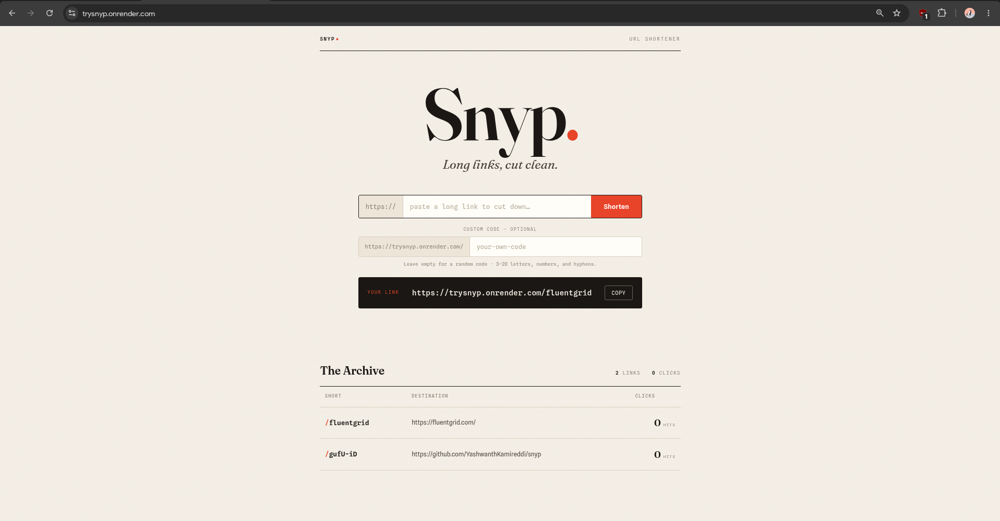
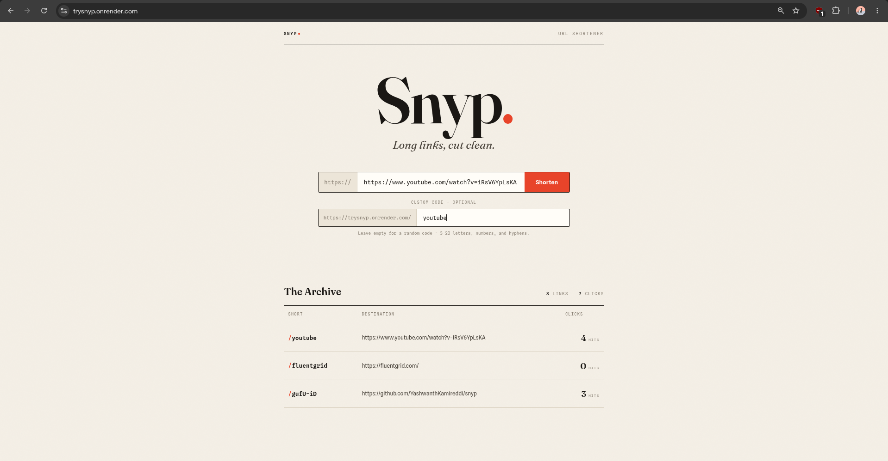

# Snyp — URL Shortener

Snyp is a small full-stack URL shortener. You paste a long link, it gives you a short one, and opening that short link takes you to the original. It also keeps track of how many times each link has been clicked.


**Live demo:** https://trysnyp.onrender.com

## Screenshots

Home page — shorten a link and see your archive below:



Using a custom code:



## Features

- Shorten any valid http/https URL into a short link
- Pick your own custom code (like `/my-portfolio`) or get a random one
- Redirects from the short link to the original URL
- Counts the clicks on each link
- Shows all the links you've made with their click counts
- Validates the input and shows a clear message when something's wrong

## Tech used

- **Frontend:** React + Vite
- **Backend:** Node.js + Express
- **Database:** SQLite (better-sqlite3)
- **Short keys:** nanoid

I went with SQLite because it's a real database that lives in a single file, so there's nothing extra to install or set up. Express keeps the API simple, and Vite makes the React side quick to work on.

## Running it locally

You need Node.js 18 or newer.

1. Install dependencies:
   ```bash
   npm run install:all
   ```
2. Start the backend (in one terminal):
   ```bash
   npm run dev:server
   ```
3. Start the frontend (in another terminal):
   ```bash
   npm run dev:client
   ```

Then open http://localhost:5173.


## API

| Method | Route | What it does |
|--------|-------|--------------|
| POST | `/api/shorten` | Takes `{ "url": "...", "customCode": "optional" }` and returns the short link |
| GET | `/api/urls` | Returns all the shortened links |
| GET | `/:key` | Redirects to the original URL and adds one to its click count |

Custom codes are 3 to 20 characters (letters, numbers, and hyphens). If a code is already taken it returns a 409.

